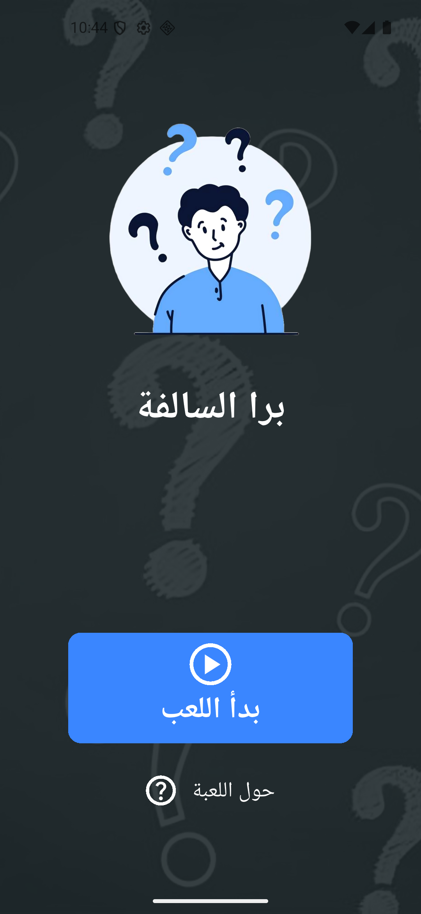
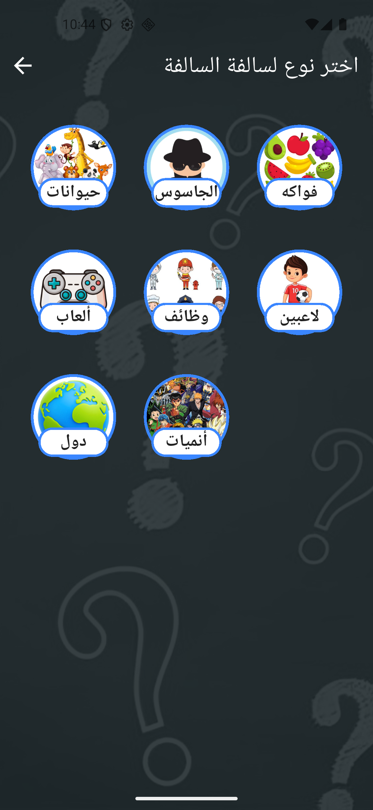
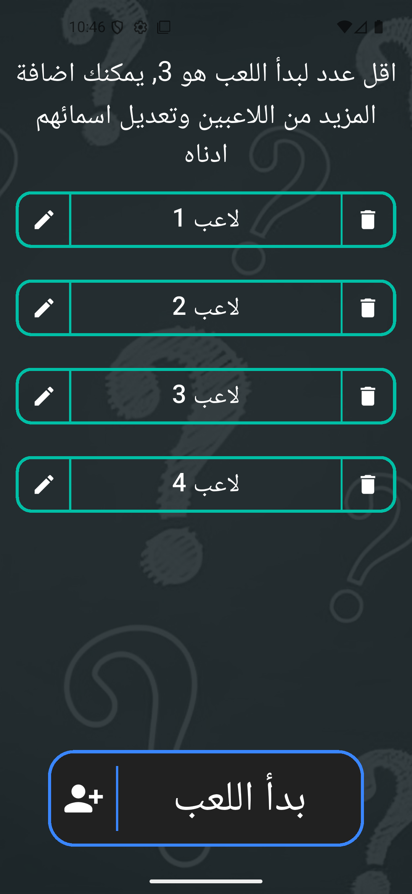
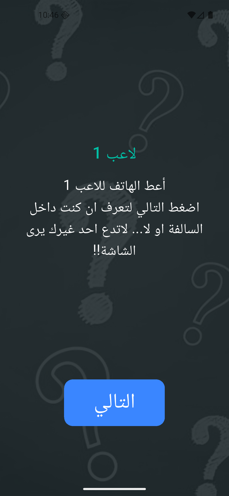
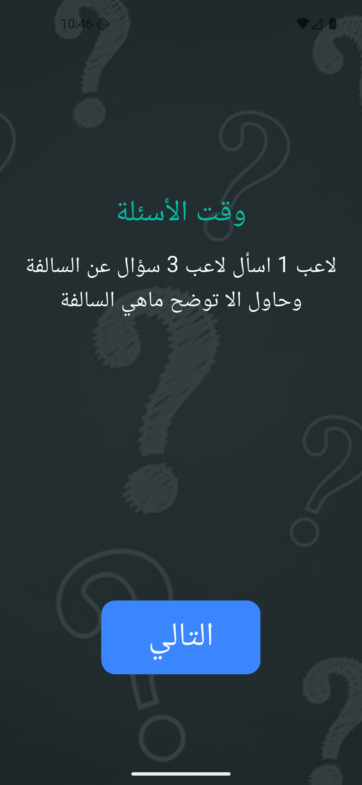
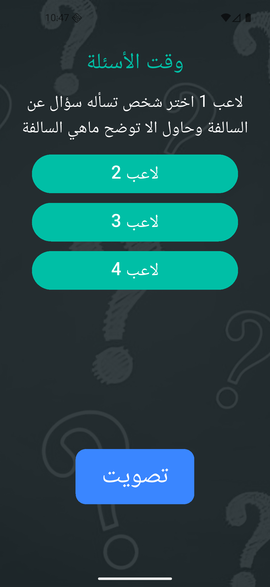
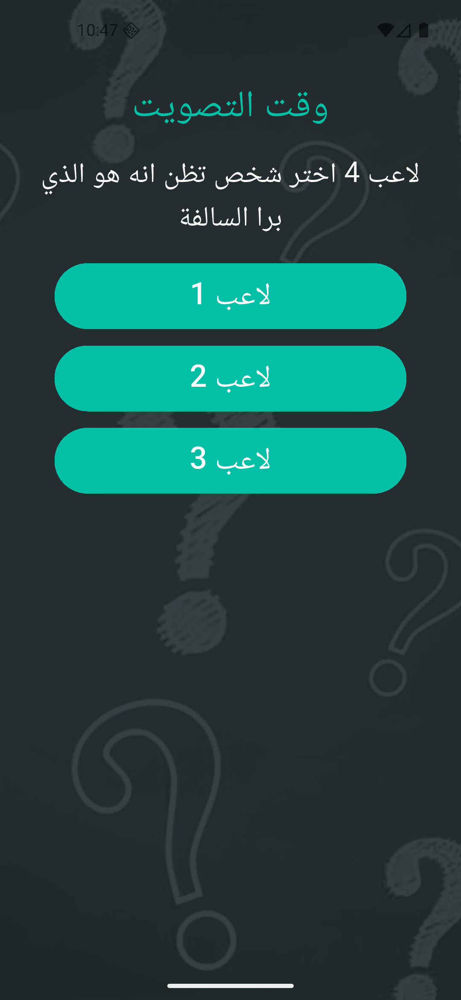
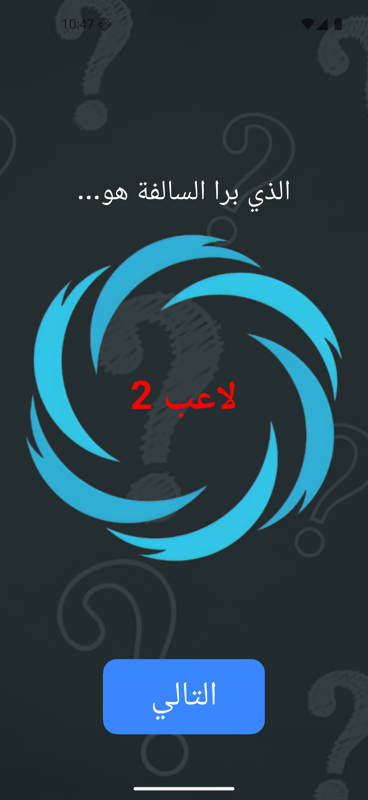
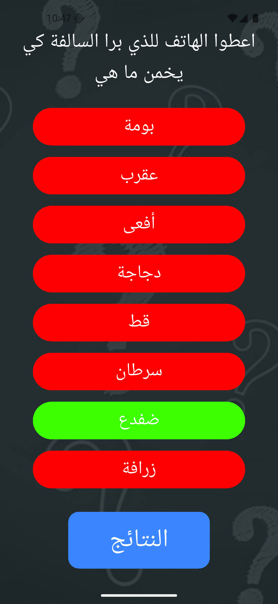
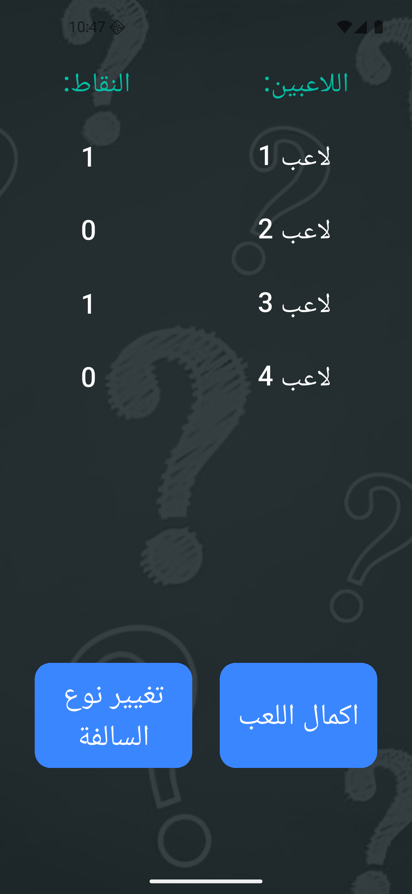

# 🎉 برا السالفة – Flutter Game

A fun multiplayer party game built with **Flutter** where players answer questions, vote, and compete against an *outside player*. Designed for friends gatherings, fast rounds, and lots of laughs!

لعبة ممتعة وسريعة للأصدقاء! 🕹️  
في كل جولة، يتم اختيار لاعب "برا السالفة" بشكل عشوائي الذي يحاول معرفة هذه السالفة، بينما البقية يحاولون معرفة هذا اللاعب.   
اللعبة مناسبة للجلسات مع العائلة أو الأصدقاء، وتضيف جو من التحدي والضحك! 😆  

---

## 🚀 Features

- 🕹️ Add players and track their scores  
- 🎭 Randomized player name reveal with sound effects (drum roll)  
- ✅ Answer validation (correct/incorrect with colors + sounds)  
- 🎨 Custom UI with themed colors and background  
- 🔊 Fun sound effects for success/fail and suspense  

---

## 📂 Project Structure

```
lib/
│
├── main.dart       # The startpoint of the application
├── utils/          # App colors
├── pages/          # Screens (Home, Game, Round Finish, etc.)
└── widgets/        # Reusable widgets (buttons, cards, backgrounds)

assets/
│
├── categories.json      # The data of the application
├── img/                 # Categories images, application icon...
└── soundEffect/         # success, fail, drum roll
```

---

## 🛠️ Getting Started

### 1. Clone the repository

```bash
git clone https://github.com/keraiyassine/Bra-Salfa.git
cd Bra-Salfa
```

### 2. Install dependencies

```bash
flutter pub get
```

### 3. Run the app

```bash
flutter run
```

---

## 📸 Screenshots  

<p float="left">
  
  
  
  
  
  
  
  
  
  
</p>

---

## 📦 Built With

- [Flutter](https://flutter.dev/) – UI Toolkit  
- [audioplayers](https://pub.dev/packages/audioplayers) – Sound effects  
- Dart  


## 📄 License

This project is licensed under the MIT License – see the [LICENSE](LICENSE) file for details.
